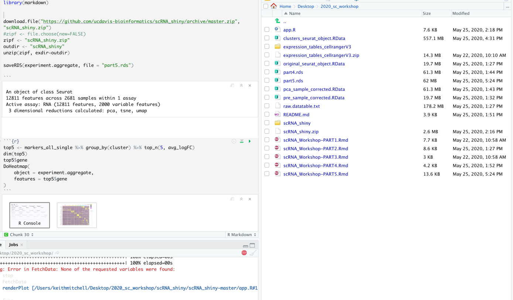
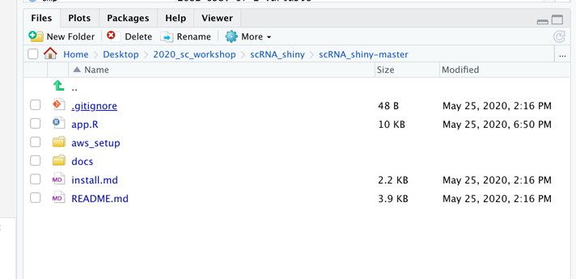
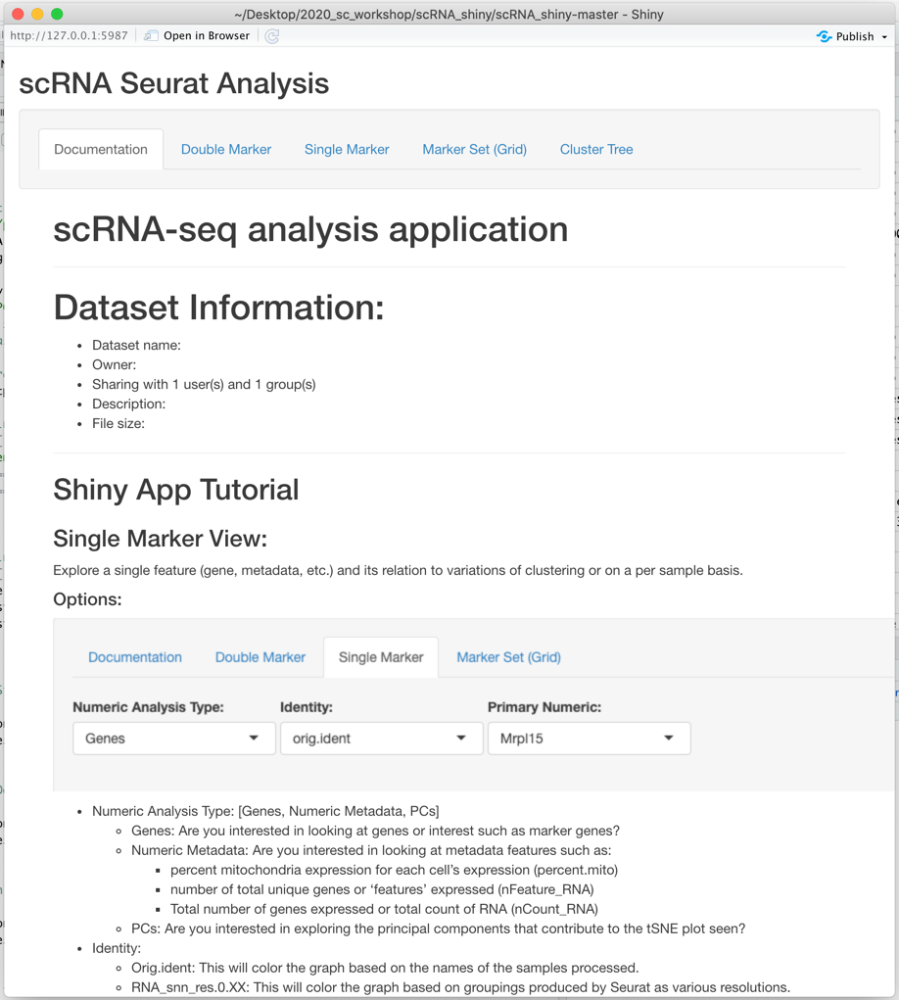
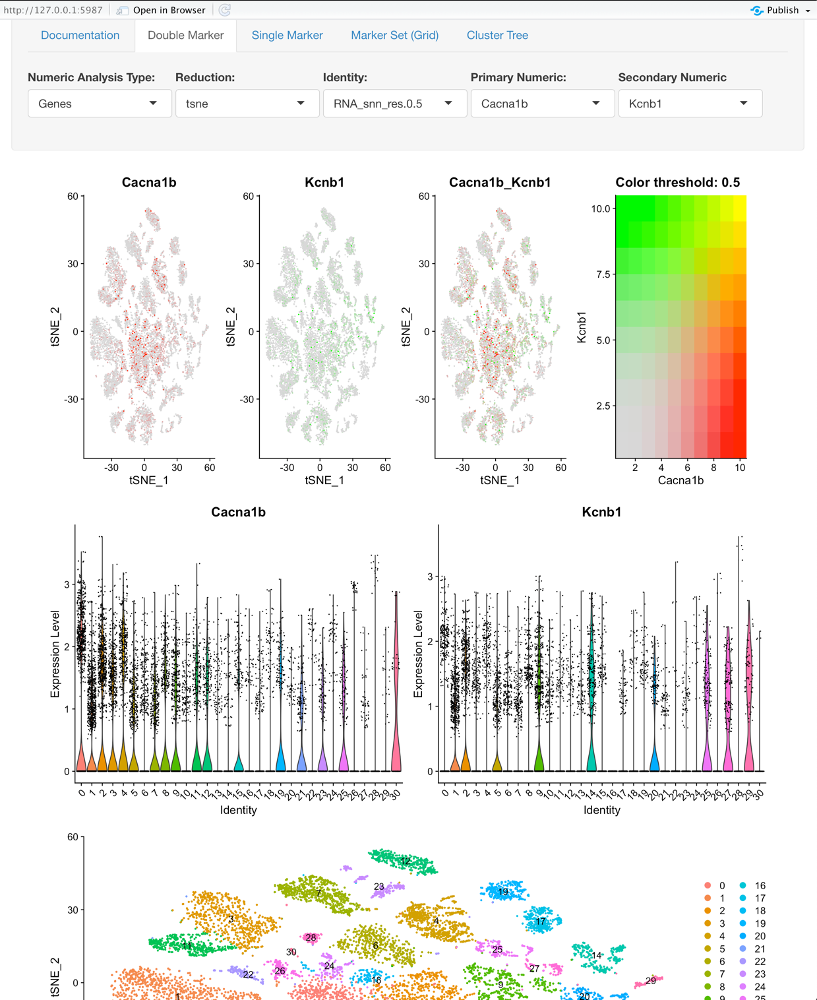
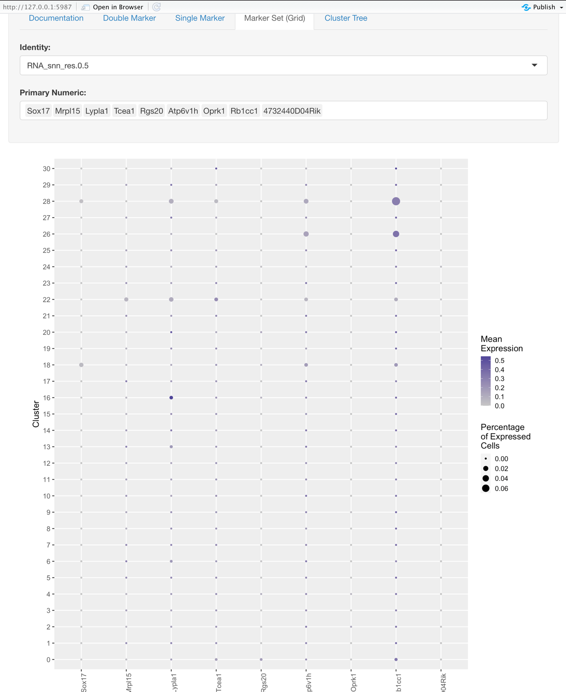
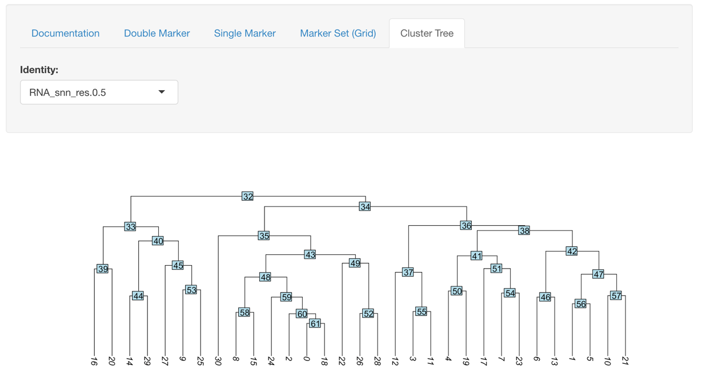

# Installing and running the app:

1. Enter the following into your Rconsole in Rstudio after finishing the Mapping_Comparison.Rmd (it is also located at
the bottom of the file itself).
    
    ```
   if (!any(rownames(installed.packages()) == "shiny")){
      install.packages("shiny")
    }
    library(shiny)
    
    if (!any(rownames(installed.packages()) == "markdown")){
      if (!requireNamespace("BiocManager", quietly = TRUE))
          install.packages("BiocManager")
      BiocManager::install("markdown")
    }
    library(markdown)
    
    if (!any(rownames(installed.packages()) == "tidyr")){
      if (!requireNamespace("BiocManager", quietly = TRUE))
          install.packages("BiocManager")
      BiocManager::install("tidyr")
    }
    library(tidyr)
    
    download.file("https://github.com/ucdavis-bioinformatics/scRNA_shiny/archive/master.zip", "scRNA_shiny.zip")
    #zipf <- file.choose(new=FALSE)
    zipf <- "scRNA_shiny.zip"
    outdir <- "scRNA_shiny"
    unzip(zipf, exdir=outdir)
    
    saveRDS(s_merged, file = "part5.rds") 

    ```

2. Enter the following into your Rconsole in Rstudio after finishing the anchoring.Rmd (it is also located at
the bottom of the file itself).
    ```
    saveRDS(s.integrated_standard, file = "anchoring.rds") 
    ```

3. You will now see a new directory appear in the workshop directory called `scRNA_shiny`:
    

4. Navigate until you see the file `app.R`. This is the file containing the app we will use for exploring the data. Open this file:
    
    
5. Now Click run app at the top of RStudio:
    
    
6. The app should now pop up in a new window:
    
    
 
 

---
# Shiny App Tutorial
---

### Single Marker View:
Explore a single feature (gene, metadata, etc.) and its relation to variations of clustering or on a per sample basis. 

#### Options: 

- Numeric Analysis Type: [Genes, Numeric Metadata, PCs]
    - Genes: Are you interested in looking at genes or interest such as marker genes?
    - Numeric Metadata: Are you interested in looking at metadata features such as: 
        - percent mitochondria expression for each cell’s expression (percent.mito)
        - number of total unique genes or ‘features’ expressed (nFeature_RNA)
        - Total number of genes expressed or total count of RNA (nCount_RNA)
    - PCs: Are you interested in exploring the principal components that contribute to the tSNE plot seen?
- Reduction Type: [PCA, TSNE, UMAP]
- Identity: 
    - Orig.ident: This will color the graph based on the names of the samples processed. 
    - RNA_snn_res.0.XX: This will color the graph based on groupings produced by Seurat as various resolutions.
        - A higher value of XX means that there is a higher resolution, and therefore more clusters or inferred groups of cell types. 
        - A lower value of XX means that there is a 
- Primary Numeric: This will change to be Genes, Numeric Metadata, or PCs based on the value selected for ‘Numeric Analysis Type’.

#### Graphs:
- The first plot is a tSNE/PCA/UMAP that is colored based on the Primary Numeric selection. 
- The second plot is a violin plot that displays the Identity selection on the X-axis and the Primary Numeric on the Y-axis. 
- The third plot is the tSNE/PCA/UMAP that is colored based on the Identity selection. 

---
### Double Marker View:
Explore two features (gene, metadata, etc.) and its relation to variations of clustering or on a per sample basis. 

#### Options: All of the options here are the same as the Single Marker View with the following field as an option.


- Secondary Numeric: This, in combination with the Primary Numeric field enables a user to explore two Genes, 
Numeric Metadata, or PCs based on the value selected for ‘Numeric Analysis Type’.

#### Graphs:
- The first plot is a tSNE that is colored based on the Primary Numeric and Secondary Numeric selection. 
- The second plot’s first tile is a violin plot that displays the Identity selection on the X-axis and the Primary
Numeric on the Y-axis. The second plot’s second tile is the same as the first tile but is based on the selection of the Secondary Numeric field. 
- The third plot is the tSNE that is colored based on the Identity selection. 

---
### Marker Set (Grid)
This plot helps to explore sets of genes and their relation to the identity. 

#### Options:

- Identity: the same as what is described for the Single Marker View
- Gene Selection: here you choose the set of genes you would like to explore based on the Identity selected. 

#### Graph:
- Y-axis represents the Identity, such as the original samples or some groupings at a certain resolution.
- X-axis represents the genes selected. (Primary Numeric) 
- The size of each dot on the grid represents the percentage of cells that expressed that gene. 
- The color intensity of each dot on the grid represents the average expression of the cells that expressed a given gene. 
- So what makes for a good marker gene for some given identity?
    - High mean expression
    - High percentage of cells expressing the gene
    - Low mean expression and percentage of cells expressing the gene for the rest of the identities
    

---
### Cluster Tree Exploration
This plot helps to identify closest related clusters so when moving into the final analysis you have a better idea of 
what the real cell groups are in your samples. 


---    
Having trouble understanding what a tSNE vs UMAP plot represents?
- However, note that in our workflow we don't cluster on the TSNE or UMAP coordinates, 
we cluster on the principal components and then use TSNE or UMAP for display, 
so the difference is purely visual. 
- tSNE helpful video: https://www.youtube.com/watch?v=NEaUSP4YerM
- UMPA vs TSNE: https://towardsdatascience.com/tsne-vs-umap-global-structure-4d8045acba17

